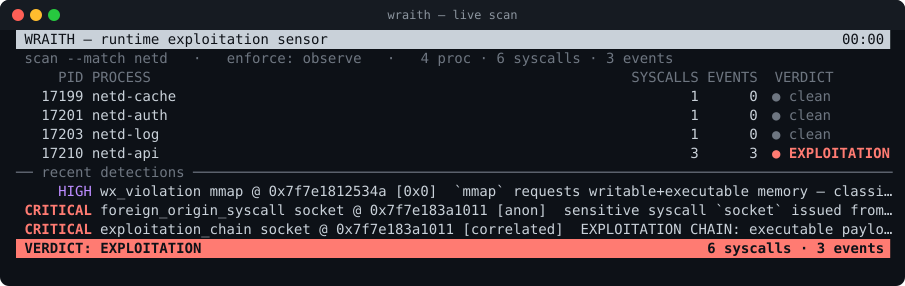

# Wraith

**Signature-free runtime exploitation detection via syscall provenance verification.**

Wraith is a low-level Rust security sensor that answers a question most tools
can't: *is this process being exploited right now?* — without knowing the
vulnerability or the payload in advance. That makes it effective against
**zero-days and n-days alike**, because it keys on the *behaviour of
exploitation*, not the *identity of the bug*.

> Built as the runtime-defence companion to [`ghost`](https://github.com/pandaadir05/ghost).
> `ghost` finds weaknesses; `wraith` catches them being used.



<p align="center"><em><code>wraith scan --ui --match netd</code> — one row per process with live syscall/event
counters, and a correlated exploitation verdict the instant injected code issues a syscall.</em></p>

---

## The idea

Defensive tooling usually answers one of two questions:

| Question | Needs to know | Blind to |
|---|---|---|
| *Does this code contain a known bug?* (SAST/scanners) | the vulnerability | zero-days |
| *Do these bytes match known-bad?* (AV/YARA) | the payload | novel payloads |

Wraith answers a **third** question — *is this process executing in a state
that only exploitation produces?* — and it needs to know neither the bug nor
the payload.

The observation behind it: **every** memory-corruption exploit, no matter the
root cause (stack overflow, UAF, type confusion, an unknown zero-day),
eventually converges on the same visible act. To accomplish anything — spawn a
shell, open a socket, read a secret — the attacker must issue **system calls**.
And at the instant those syscalls happen, the process is in a state that
legitimate execution *never* produces.

Wraith attaches to a process with `ptrace`, stops at the entry of every
syscall, and checks a handful of invariants that hold for all benign programs:

1. **Provenance** — a `syscall` instruction only ever runs from a *file-backed
   executable page* (the program's own `.text`, a shared library, or the kernel
   vDSO). Shellcode injected into the heap, stack, or an anonymous page
   **breaks this**.
2. **W^X** — no benign program needs a page that is writable *and* executable,
   nor to flip a writable page to executable. Payload staging **breaks this**.
3. **Stack integrity** — at syscall time the stack pointer lives inside a real
   stack, never the heap or a file image. A ROP stack pivot **breaks this**.

Because these are invariants of *legitimate behaviour* rather than signatures
of *specific attacks*, any violation is evidence of exploitation regardless of
how the attacker got there.

---

## Quickstart

```bash
cargo build --release

# Monitor a program you launch:
./target/release/wraith run -- /usr/bin/some-service --flags

# Monitor a process that's already running:
sudo ./target/release/wraith attach 4242

# Monitor every process matching a name at once:
sudo ./target/release/wraith scan --match nginx

# Emit machine-readable events for your SIEM/pipeline:
./target/release/wraith run --json events.jsonl -- ./target
```

Wraith exits `0` when clean, `1` on suspicious (HIGH) activity, and `3` when it
detects exploitation (CRITICAL) — so it drops straight into CI and fuzzing
harnesses as a behavioural oracle.

### See it work

The repo ships two self-contained targets (no real exploit required):

```console
$ wraith run --min info -- ./target/release/benign
wraith: monitoring `./target/release/benign` (provenance mode)
benign: ... normal work ...
wraith: 81 syscalls, 0 event(s); verdict: clean          # <- false-positive control

$ wraith run -- ./target/release/shellcode-sim
    HIGH pid=6586 wx_violation           mmap   @ 0x7fa8ad52534a  `mmap` requests writable+executable memory — classic shellcode staging
CRITICAL pid=6586 foreign_origin_syscall socket @ 0x7fa8ad696011 [anon]  sensitive syscall `socket` issued from wx-violation memory — injected code is now acting
CRITICAL pid=6586 exploitation_chain     socket @ 0x7fa8ad696011 [correlated]  EXPLOITATION CHAIN: executable payload staged (W^X) -> sensitive syscall from injected code
wraith: 69 syscalls, 3 event(s); verdict: EXPLOITATION DETECTED
```

`shellcode-sim` stages an RWX page, writes a payload into it, and issues a
syscall from that page — the exact tail end of a real exploit — and Wraith
catches every stage and correlates them into one verdict.

---

## What it detects

| Event | Severity | Meaning |
|---|---|---|
| `foreign_origin_syscall` | HIGH / CRITICAL | A syscall issued from non-code memory (heap/stack/anon/RWX). CRITICAL when the syscall is *sensitive* (execve, connect, ptrace, …). |
| `wx_violation` | HIGH | `mmap`/`mprotect` requesting writable **and** executable memory. |
| `wx_transition` | HIGH | A writable page being flipped to executable — payload staging. |
| `stack_pivot` | HIGH | Stack pointer sitting in the heap or a file image at syscall time — a ROP indicator. |
| `crash` | HIGH | Target took SIGSEGV/SIGILL/SIGBUS/SIGABRT — often a *failed* exploit worth investigating. |
| `exploitation_chain` | CRITICAL | Multiple primitives correlated into a single high-confidence verdict. |
| `sensitive_call` | INFO | Audit breadcrumb (with `--audit-sensitive`): a sensitive syscall from legitimate code. |
| `blocked` | CRITICAL | Enforcement neutralised the offending syscall in place (`--block`). |
| `killed` | CRITICAL | Enforcement killed the traced tree on confirmed exploitation (`--kill`). |

Tuning:

```
--jit-critical      treat anonymous-exec pages as HIGH (targets that never JIT)
--trust-region A-B  treat the hex range [A,B) as legitimate JIT (repeatable)
--ui                live full-screen dashboard instead of the log stream
--no-stack-pivot    disable the ROP stack-pivot heuristic
--audit-sensitive   log sensitive syscalls from legitimate code too
--min <sev>         floor: info|warn|high|critical (default warn)
```

---

## Active response (enforcement)

By default Wraith only *detects* — it never touches the tracee. Because it sits
at the syscall-entry stop, though, it is standing at the one moment the
offending syscall has not yet run, so it can also *stop* the attack:

```bash
# Neutralise the offending syscall in place — the injected code's execve/connect
# returns an error and never takes effect; the process lives on so you can watch
# what it does next.
wraith run --block -- ./target

# Terminate the whole traced tree the instant exploitation is confirmed, before
# the offending syscall executes.
wraith run --kill  -- ./target
```

Both fire only on a **CRITICAL** verdict — injected code issuing a *sensitive*
syscall, or a correlated exploitation chain — so a HIGH/WARN anomaly (a JIT
page, a lone RWX mapping) never trips enforcement. `--block` overwrites the
syscall number at its entry stop so the kernel skips it and returns `-ENOSYS`;
`--kill` sends `SIGKILL` to every traced thread-group.

### Trusting a JIT

Language runtimes (Node.js, the JVM, .NET, browsers) execute JIT-compiled code
from anonymous executable pages and flip writable pages to executable as they
compile — behaviour that looks, syscall-for-syscall, like payload staging. When
you know where a runtime places its code, hand Wraith the range and it treats
provenance and W^X inside it as legitimate:

```bash
# Trust one or more JIT arenas (repeat --trust-region as needed).
wraith run --trust-region 7f2a10000000-7f2a14000000 -- ./node-service
```

Trust applies to concrete addresses — the syscall's execution site and an
`mprotect` target page — so a JIT that respects W^X (map RW, write, `mprotect`
RX) is fully exempted, while a *direct* RWX allocation elsewhere is still
flagged.

---

## Scanning many processes at once

`run` and `attach` watch a single process tree. `scan` attaches to a whole set
of already-running processes in one shot — select them by name/cmdline
substring, or take everything you have permission to trace:

```bash
# Attach to every process whose name or command line contains "nginx"
# (repeat --match to widen the net); follows the children they spawn too.
sudo wraith scan --match nginx --match redis

# Attach to every process we're allowed to trace (heavy — see below).
sudo wraith scan --all --min high
```

One tracer drives all of them through a single reap loop, and enforcement
(`--block`/`--kill`) and the JSON stream work exactly as they do for a single
target. Caveats worth knowing:

- **Needs privilege.** Attaching to a process you don't own requires
  `CAP_SYS_PTRACE` (run as root); processes you can't attach to are skipped, not
  fatal.
- **It has a cost.** Every traced process pays the two-stops-per-syscall
  `ptrace` tax, so `--all` on a busy host is expensive — prefer `--match`.
  Whole-system, near-zero-overhead monitoring is the eBPF backend's job (below).
- **Non-destructive by default.** Unlike `run`, `scan`/`attach` do *not* set
  `PTRACE_O_EXITKILL`: stopping Wraith leaves every scanned process running.
- **Post-attach threads only.** As with `attach`, sibling threads that already
  existed before Wraith attached aren't picked up automatically (see below).
- **Never traces itself.** `scan` excludes its own process and its whole
  ancestor chain (the shell/terminal that launched it), so a broad `--match`
  can't accidentally attach to — and hang on — the tool that started it.

### Live dashboard (`--ui`)

Add `--ui` to any mode for a full-screen terminal dashboard instead of the
scrolling log — the picture at the top of this README is exactly that, on the
scan flow:

```bash
sudo wraith scan --ui --match nginx
```

One row per traced process with live syscall/event counters and a colour-coded
verdict (`clean` → `suspicious` → `EXPLOITATION`), above a feed of the most
recent detections and a status bar carrying the aggregate verdict. It repaints
on every detection and at ~20 fps otherwise, restores the terminal cleanly on
exit or Ctrl-C, and still honours `--json` (the event stream is written to the
sink underneath the UI). The dashboard is hand-rolled ANSI — no TUI dependency
— so the sensor's supply chain stays `nix` + `libc` only.

---

## Architecture

Small, auditable, and dependency-light on purpose — a sensor others run should
carry the smallest supply chain you can manage. The engine links only `nix` and
`libc`; JSON is emitted by hand.

```
  src/
   ├─ maps.rs        parse /proc/<pid>/maps into typed regions
   ├─ provenance.rs  classify an instruction/stack pointer against the map
   ├─ syscalls.rs    the syscall table Wraith cares about
   ├─ detect.rs      the invariants + the exploitation-chain correlator
   ├─ event.rs       detection events + their JSONL form
   ├─ engine.rs      the transport-agnostic detection core (Backend trait, Engine)
   ├─ tracer.rs      the ptrace Backend (spawn/attach/scan, thread-following, enforcement)
   ├─ ui.rs          the live terminal dashboard (--ui), hand-rolled ANSI
   └─ bin/
       ├─ wraith.rs           the CLI sensor
       ├─ benign.rs           false-positive control target
       ├─ benign_threads.rs   multithreaded false-positive control
       ├─ shellcode_sim.rs    exploitation-behaviour simulator
       └─ mt_shellcode_sim.rs exploitation from a worker thread
```

The tracer adds no syscall of its own on the hot path beyond the unavoidable
`getregs`, and re-reads `/proc/<pid>/maps` only when a memory operation could
have changed it.

**Transport-agnostic core.** Detection is split from transport behind a
`Backend` trait. The `ptrace` tracer is the first backend: it captures each
syscall-entry into a neutral register snapshot and hands it to the shared
`Engine`, which owns the cached memory map, the per-process stats, the detector,
and the enforce-on-CRITICAL policy — and never issues a `ptrace` call itself.
The same `Engine` drives any transport unchanged, so the planned eBPF backend
(below) reuses the entire detection model and only swaps how a syscall stop is
obtained.

**Thread-following.** Real targets — network daemons, request handlers, fuzz
harnesses — are multithreaded, and an exploit can fire from any thread. Wraith
follows every `clone`/`fork`/`vfork` the target makes and inspects syscalls
from *all* of them. Threads that share an address space share one cached memory
map and one exploitation-chain accumulator, so a payload staged on one thread
and fired from another is still correlated into a single verdict — while
separate processes keep separate state.

---

## Limitations & roadmap

Wraith is an honest research prototype with a clear production path; it does not
claim to be a finished EDR.

- **`ptrace` overhead.** Two stops per syscall suits high-value targets
  (network daemons, parsers, fuzz targets), not the whole system. The
  production path is the same logic on **eBPF** (`tracepoint/raw_syscalls` +
  a page-provenance map) for near-zero overhead — the detection model is
  transport-agnostic by design, and now lives behind a `Backend` trait
  (`src/engine.rs`) so that eBPF backend slots in beside the `ptrace` one
  without touching detection. (eBPF observes rather than stops, so it would be
  the low-overhead *observe* backend; `ptrace` stays for lossless capture and
  `--block`/`--kill`, which need the tracee held at syscall entry.)
- **Attach vs. pre-existing threads.** `wraith run` and `wraith attach` follow
  every thread and child the target spawns *after* tracing begins (via
  `PTRACE_O_TRACECLONE`/`FORK`/`VFORK`). When attaching to an already-running
  multithreaded process, only the threads that clone after attach are picked
  up automatically; seizing every pre-existing sibling thread is a small
  follow-up.
- **Pure-ROP that never leaves legit code.** An attacker who only reuses
  existing `.text` and never stages new executable memory won't trip the
  provenance rule — that's what the stack-pivot heuristic is for, and why
  return-address validation and a shadow stack are on the roadmap.
- **Legitimate JIT** (browsers, JVMs, .NET) runs code from anonymous
  executable pages; hence `AnonExec` is WARN by default, `AnonExec` can be
  raised with `--jit-critical`, and known JIT arenas can be exempted outright
  with `--trust-region`.
- **Coverage vs. cost.** `scan --match`/`--all` can watch many processes at
  once, but every traced process pays the two-stops-per-syscall `ptrace` tax, so
  this suits a handful of high-value targets rather than a busy whole system.
  Near-zero-overhead, watch-everything monitoring is the eBPF backend's job (see
  below), not something the `ptrace` engine should attempt.

Roadmap: eBPF backend (near-zero-overhead, system-wide) · return-address/
shadow-stack checks · ROP-chain length heuristics · per-thread stack tracking ·
seizing pre-existing threads on attach · per-process behavioural baselining ·
richer JIT policy (auto-learn a runtime's arenas rather than hand-supplied
ranges).

---

## Building & testing

```bash
cargo build --release
cargo test          # 42 unit + 10 end-to-end tests
cargo clippy --all-targets
./demo.sh           # side-by-side benign vs. exploitation run
```

The end-to-end tests drive the real ptrace engine over the `benign`,
`benign-threads`, `shellcode-sim`, and `mt-shellcode-sim` binaries — including
an exploit fired from a worker thread to exercise thread-following. They
self-skip where `ptrace` is unavailable.

## License

MIT — see [LICENSE](LICENSE).
