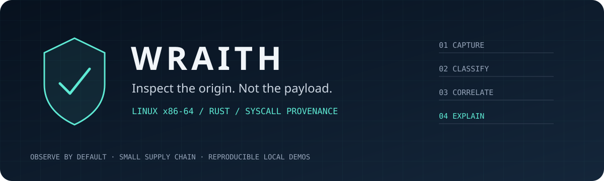
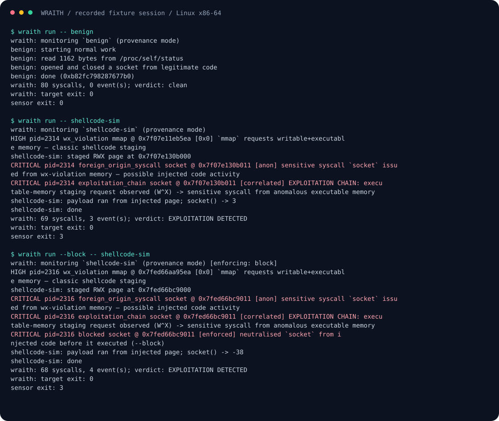

<p align="center"></p>

<p align="center">
  <a href="https://github.com/grloper/Wraith/actions/workflows/ci.yml"></a>
  
  <a href="LICENSE"></a>
</p>

# Wraith

**A small Rust runtime sensor that inspects where Linux syscalls come from.**

Injected code can change its bytes. It still has to execute somewhere. Wraith uses
`ptrace` and `/proc/<pid>/maps` to flag sensitive syscalls from suspicious executable
memory, inspect W^X requests, and correlate signals across threads. No payload signatures,
cloud service, or model required. Only two direct Rust dependencies: `nix` and `libc`.

**For:** security researchers, focused service monitoring, exploit-behavior experiments,
and fuzzing triage. **Not:** a complete EDR, a vulnerability scanner, or proof that a
process is uncompromised. Read the [threat model](docs/threat-model.md) before enforcing.

> Observe-only by default. Linux x86-64. Controlled deployments should start with a
> representative benign baseline. Zero false positives and universal exploit coverage
> are not promised.

## See the evidence



*Recorded from real local fixture runs; paths abbreviated. PIDs, addresses and counts
vary. Recreate with `python3 scripts/record_demo.py`. [Replayable terminal recording](docs/demo.cast).
The older [scan dashboard illustration](docs/scan-demo.svg) is illustrative, not a benchmark.*

## Try it in two minutes

Prerequisites: Linux x86-64, Rust 1.74+, mounted procfs, and permission to trace your own
child process. WSL2 works; restricted containers may deny `ptrace`.

```bash
git clone https://github.com/grloper/Wraith.git
cd Wraith
cargo build --release --locked
bash demo.sh
```

The demo checks **six outcomes**, rather than merely printing expected results:

| Local fixture | Required outcome |
|---|---|
| `benign` | No detections, sensor exit `0` |
| `benign-threads` | No detections across worker threads, exit `0` |
| `shellcode-sim` | RWX staging + sensitive syscall from that page, exit `3` |
| `mt-shellcode-sim` | Same behavior on a worker thread, exit `3` |
| `shellcode-sim --block` | Syscall returns `-ENOSYS`; fixture survives, exit `3` |
| `shellcode-sim --kill` | Traced tree terminated before payload syscall, exit `3` |

These are **safe local behavior simulators**, not exploitation of a real vulnerability:
the payload opens a socket and closes it; it does not connect or exfiltrate data.

## Use it

```bash
# Launch and observe one program and its future children.
./target/release/wraith run -- /usr/bin/your-service --foreground

# Attach to an existing process (ownership / Yama policy applies).
sudo ./target/release/wraith attach 4242

# Observe a selected set, never start with an entire busy host.
sudo ./target/release/wraith scan --match nginx --max-targets 4

# Human-readable output on stderr; append JSONL evidence to a file.
./target/release/wraith run --json events.jsonl -- ./your-target

# Live terminal dashboard.
sudo ./target/release/wraith scan --ui --match nginx
```

Sensor exit status: `0` no HIGH/CRITICAL events; `1` HIGH activity; `2` operational or
usage error; `3` CRITICAL activity. **This is not the target's exit status.** A failed
program can have a clean sensor verdict. `--min` filters output, not detection or exit status.

### Detection policy

| Signal | Default interpretation |
|---|---|
| Sensitive syscall from RWX, executable heap or stack | CRITICAL provenance anomaly |
| Syscall from anonymous RX code, including named anonymous mappings | WARN; legitimate JIT is possible |
| `mmap` / `mprotect` requests RWX | HIGH staging **request**, not proof the kernel accepted it |
| Writable→executable transition | WARN by default (normal W^X JIT behavior); HIGH with explicit no-JIT policy |
| Stack pointer in heap or a file mapping | HIGH heuristic; custom stacks can be legitimate |
| Missing / non-executable origin in the map | Coverage uncertainty, not proof of injection |
| Correlated anomalous sensitive execution and staging | CRITICAL chain under the configured origin policy |
| Fatal target signal | HIGH crash indicator; crashes are not automatically attacks |

**Anonymous RX is not automatically CRITICAL.** `--jit-critical` is an explicit
no-JIT policy: it raises ordinary anonymous-origin calls to HIGH and sensitive ones
to CRITICAL. Use it only when that assumption fits the workload.

`--trust-region START-END` exempts operator-vouched half-open hexadecimal address
ranges from provenance and fully covered, page-rounded protection requests. Trust is an explicit
blind spot, **not automatic JIT attestation**. ASLR makes static ranges fragile;
never trust broad ranges merely to make alerts disappear.

`--no-stack-pivot` disables the custom-stack-sensitive heuristic.
`--audit-sensitive` adds INFO breadcrumbs for sensitive calls from accepted code.
See `wraith --help` and [operator guidance](docs/operations.md).

### Optional enforcement

```bash
# On a CRITICAL event only: skip the current syscall, returning -ENOSYS.
./target/release/wraith run --block -- ./your-target

# On a CRITICAL event only: SIGKILL the traced process tree.
./target/release/wraith run --kill -- ./your-target
```

Enforcement can break a legitimate application if its memory policy resembles injection.
Baseline first, review evidence, then opt in. It is not a substitute for sandboxing.

## How it works

```text
Linux ptrace syscall stop → registers + cached /proc maps
                         → origin / W^X / stack checks
                         → per-address-space correlation
                         → JSONL + terminal reporter
                         → observe (default) / block / kill
```

- **Transport-independent engine:** `src/engine.rs` owns policy, maps and statistics;
  `src/tracer.rs` owns Linux tracing and enforcement.
- **Sorted interval lookup:** provenance uses binary search over parsed mappings.
- **Shared process state:** worker threads share map and correlation state.
- **Small supply chain:** no async runtime, TUI framework or serialization dependency.

Every syscall still pays the `ptrace` stop/resume cost. This is focused monitoring,
not low-overhead whole-host telemetry. Measure your own workload:

```bash
python3 scripts/benchmark.py --iterations 20000 --samples 5
```

The script reports raw timings, kernel and median slowdown; it does not manufacture a
performance claim. An eBPF backend is **not implemented**. Observation and synchronous
syscall blocking require different kernel mechanisms; see [research notes](docs/research.md).

## Build, test, contribute

```bash
bash scripts/verify.sh        # formatting, Clippy, strict real-ptrace tests, docs
cargo build --release --locked
bash demo.sh                 # asserted detection + enforcement demo
```

CI requires actual ptrace execution (`WRAITH_REQUIRE_PTRACE=1`) rather than silently
accepting skipped integration tests. The [verification notes](docs/verification.md)
distinguish measured evidence from untested environments.

Start with [CONTRIBUTING.md](CONTRIBUTING.md), [the architecture](docs/architecture.md),
or [small, testable contribution ideas](docs/roadmap.md). Report security issues using
[SECURITY.md](SECURITY.md). Changes are tracked in [CHANGELOG.md](CHANGELOG.md).

**Want to help?** Reproduce a benign false positive, add a regression fixture, or measure
an actual service workload. Those contributions matter more than a badge or star count.
[Launch kit and resume-ready project summary](docs/launch.md).

MIT · [LICENSE](LICENSE)
